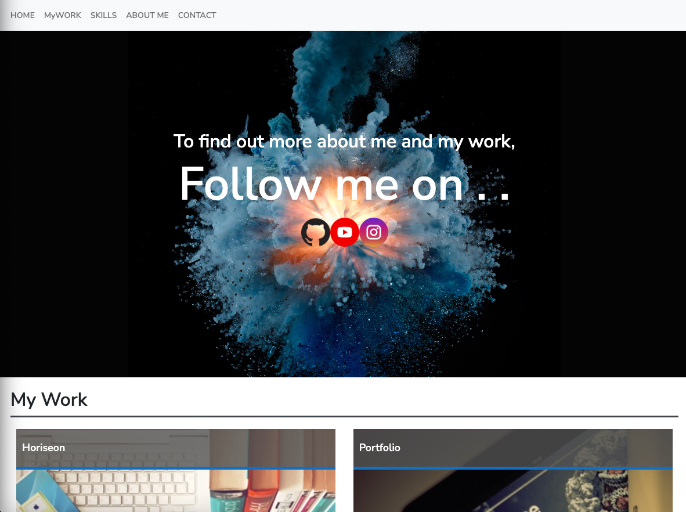

# Bootstrap-Portfolio

** On this Portfolio Website I've tried to demostrate my learned habilities with HTML and CSS and appliyng a responsive layout on it. **

- Site contains the following sections:

* Fixed navbar on the very top of the website.
* A jumbotron with the socia media links on it.
* A Work section with a small portfolio of projects.
* The next section is the Skills section where you can find a little bit more about my habilities as Front-End Develoer.
* About Me and Contact section.
* Footer with the website links and a Subscribe form.

- I have made this website resposive. For this reason you will be able to open it on a small screen device and you can still see and read everything perfectly.

- Please see below the deployed link of the project.

Link: https://diegodagostim.github.io/Bootstrap-Portfolio/

- Please see below the Github folder link:

Link: https://github.com/diegodagostim/Bootstrap-Portfolio

